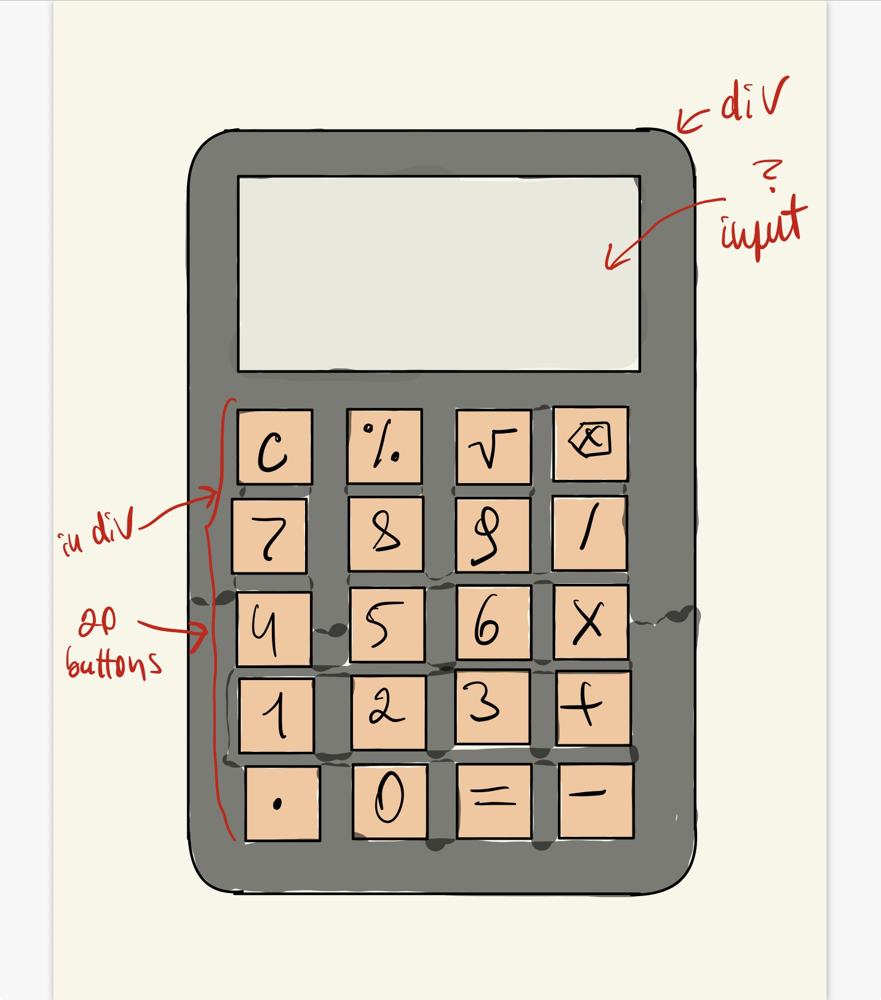

# Calculator 09-14.02.2026
This plan shows the `intended approach` before starting coding.

## Overview

| `Date`    | `Todos`                      |
| --------- | ----------------------       |
| 09.02     | Project started              |
| 10.02     | Layout implemented           |
| 11-13.02  | JS logic implemented         |
| 14.02     | Project finalized            |
 

## Mockup

## Procedure

### 09-10.02.2026
1. Create initial plan
2. Send plan to mentor & wait for feedback
3. Initialize repository
4. Build layout & push

### 11-13.02.2026
1. Implement operator & operand functions
2. Implement delete character function
3. Implement clear input function

## Issues / Tasks

### 09-10.02.2026
- [Create HTML calculator structure](https://github.com/fortunatus-png/Simple-JavaScript-Calculator/issues/3)
- [Style with CSS flexbox and grid](https://github.com/fortunatus-png/Simple-JavaScript-Calculator/issues/4)

### 11-13.02.2026
- [Number input & Clear funtionality](https://github.com/fortunatus-png/Simple-JavaScript-Calculator/issues/5)
- [Input validation](https://github.com/fortunatus-png/Simple-JavaScript-Calculator/issues/8)
- [Basic arithmetic operations](https://github.com/fortunatus-png/Simple-JavaScript-Calculator/issues/6)
- [Advanced features](https://github.com/fortunatus-png/Simple-JavaScript-Calculator/issues/7)
